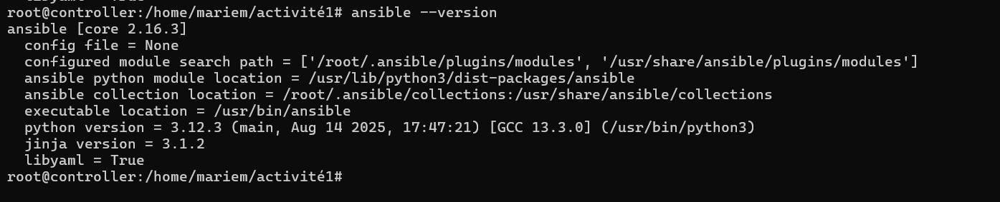
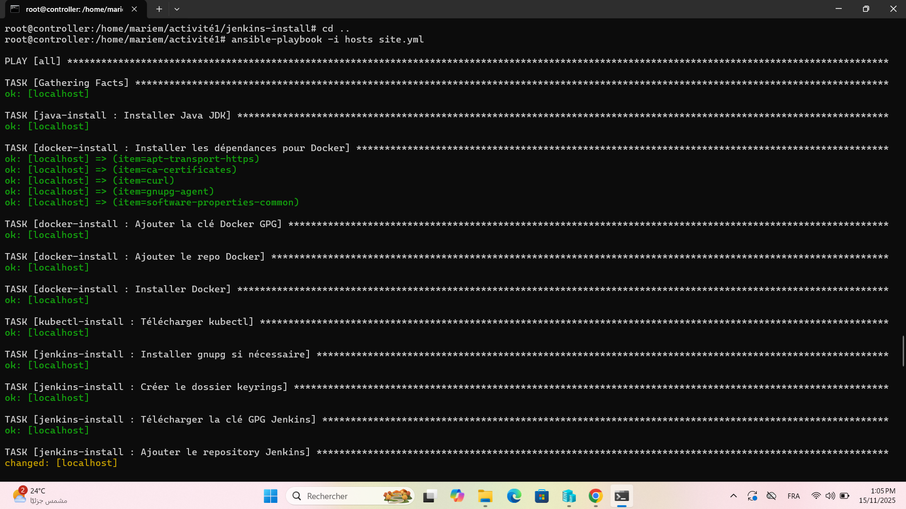
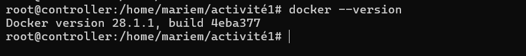
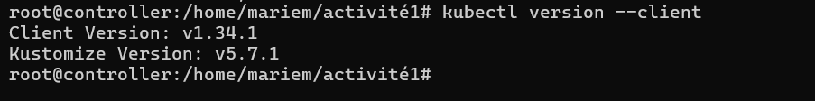
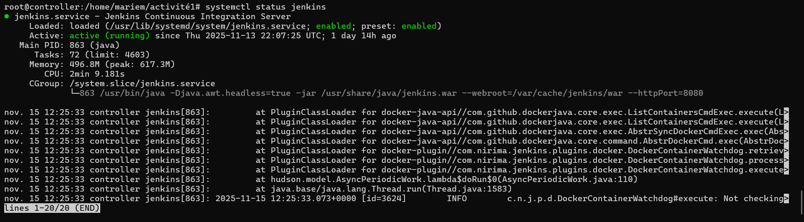

## Activité 1 – Automatisation d’installation avec Ansible

## Description

Ce projet consiste à automatiser l’installation et la configuration de plusieurs outils DevOps essentiels sur un serveur Ubuntu, en utilisant Ansible.
Les outils installés automatiquement sont :

Java JDK

Docker + Docker Engine

Kubectl

Jenkins

Toutes les installations se font via un playbook Ansible unique (site.yml) qui exécute des rôles spécialisés.

📂 Structure du projet
activité1/
│
├── hosts
├── site.yml
│
├── roles/
│   ├── java-install/
│   │   └── tasks/main.yml
│   ├── docker-install/
│   │   └── tasks/main.yml
│   ├── kubectl-install/
│   │   └── tasks/main.yml
│   └── jenkins-install/
│       └── tasks/main.yml
│
└── README.md

1. Prérequis

Avant d'exécuter le playbook, assure-toi que :

✔ Ansible est installé :
sudo apt update
sudo apt install ansible -y

✔ Vérification de la version :
ansible --version

2. Inventaire Ansible (hosts)

Le fichier hosts doit contenir :

[local]
localhost ansible_connection=local

3. Playbook principal : site.yml

Ce fichier appelle l’ensemble des rôles :

- hosts: all
  become: yes
  roles:
    - java-install
    - docker-install
    - kubectl-install
    - jenkins-install

4. Exécution du playbook

Pour lancer l'installation automatisée :

ansible-playbook -i hosts site.yml

5. Fonctionnement des rôles

🔹 Rôle 1 : java-install

Installe automatiquement Java JDK via APT.

🔹 Rôle 2 : docker-install

Installe les dépendances

Ajoute la clé GPG Docker

Ajoute le repository

Installe Docker Engine

🔹 Rôle 3 : kubectl-install

Télécharge et installe Kubectl depuis les releases officielles.

🔹 Rôle 4 : jenkins-install

Ajoute le repository Jenkins

Ajoute la clé GPG Jenkins

Installe le service Jenkins

Active le service système

6. Vérifications après installation
   
Vérifier Docker :

docker --version

Vérifier Kubectl :

kubectl version --client

Vérifier Jenkins :

systemctl status jenkins

